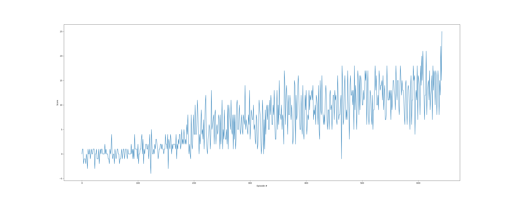

# Overview

This project uses pytorch to implement Deep Q-Learning (DQN) with replay to solve a banana navigation problem wherein an agent in a Unity environment must collect yellow bananas and avoid blue bananas.
Each yellow banana collected provides a reward of `+1` and each blue banana collected provides a reward of `-1`.
A straight-forward solution was obtained using an epsilon-greedy policy in conjunction with DQN that was patterned off of the `openai/gym` lunar lander navigation problem.

# Scenario
After the environment has been initially configured, the agent is trained until success is reached or 2000 episodes have elapsed.
For each episode, the score is reset to zero and the environment presents states while the agent chooses actions (using the current training model, not the target model).
The episode is considered to have finished when either 1000 steps have elapsed OR the environment signals that the episode is done.
Actions are chosen by the agent using an epsilon-greedy policy based on the state-action pair Q-values available in the learning NN, and the value of epsilon slowly decays between episodes as the network is trained.
The agent is trained every 4 timesteps on a random set of samples from the replay buffer provided that the buffer contains at least 64 samples, and the temporal-difference loss function is generated with a fixed q-target across the samples to use for gradient descent.
It is important to note that the agent `act` method uses the local q-network to determine next actions, and during the `step` method--where training occurs--the target q-network is used as the source of truth for generating stochastic gradients.

Once the agent has achieved an average score of greater than 13 for 100 episodes, training is considered complete and the q-network is saved.

## Neural Network Design
The neural network used for this solution is crafted using the torch package (pytorch).
In particular, the input state passes through two hidden layers, each with 64 nodes, and then on to the action output.
Rectified linear activation (ReLU) is used in these hidden layers since the network will be trained with stochastic gradient descent using backward propagation.

The learning-rate for this propagation (loosely, the length of the step of the stochastic gradient descent) was 0.0005 using the Adam optimizer.

## Selected Hyperparameters
| Parameter   | Value |
| ----------- | ----------- |
| Buffer Size | 10000       |
| Batch Size  | 64        |
| Discount Factor | 0.99 |
| Soft Update Parameter| 0.99  |
| Learning Rate | 5e-4 |
| Network Update Rate | 4 |

# Outcome
**This agent was able to train to the success criterion in 543 episodes.**  The result of that training can be seen below.

# Future Work
The performance of this agent could be improved in a variety of ways.
The easiest of these include continuing to tune the hyper parameters and increasing the threshold for successful training.
Another easy improvement might be implementing prioritized experience replay so that only "interesting" samples are saved, where interesting samples are those that have comparatively large temporal difference terms.

With more effort, performance could be improved by moving away from simple DQN to either double DQN or dueling DQN.

At the far end of the spectrum, the space of actions could be made continuous and DQN to give way to Deep Deterministic Policy Gradient (DDPG).
This could certainly increase the ability of the agent to navigate within the environment and should inevitably increase performance, but it would require changes to both the agent and the environment which is probably out of scope.
